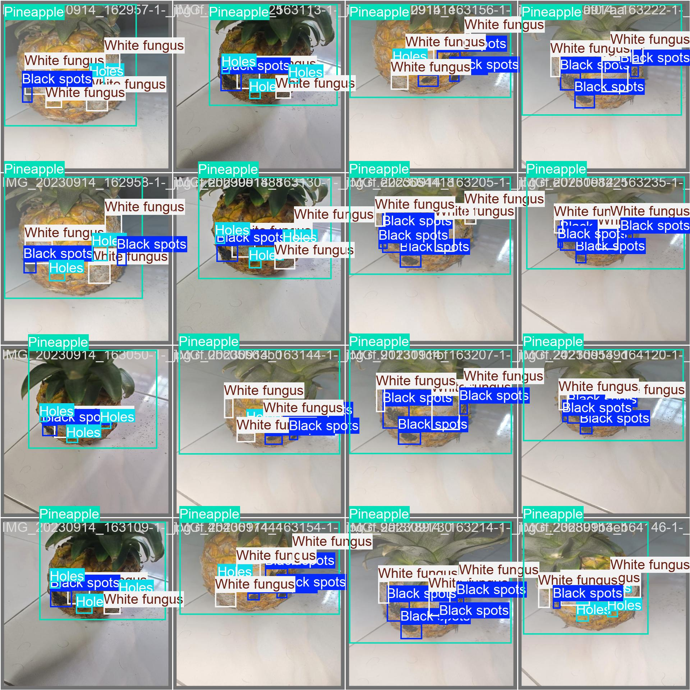
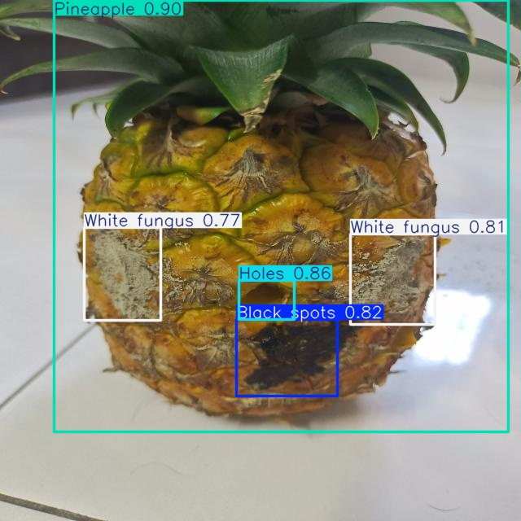
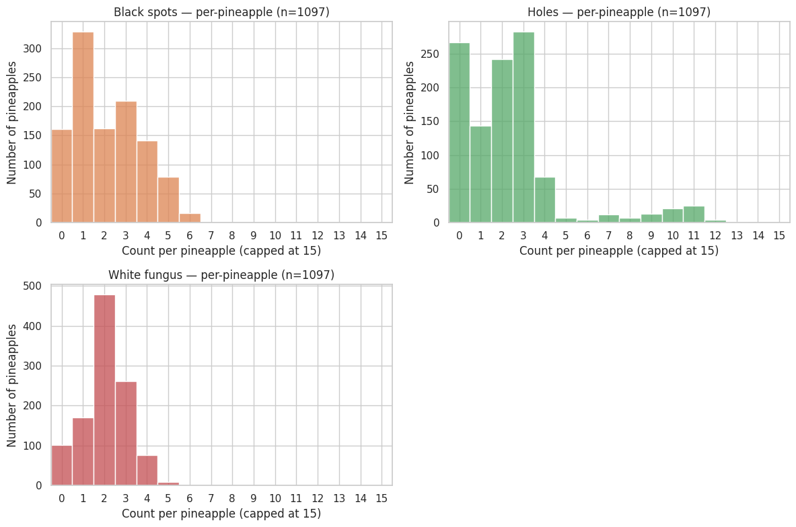

# Crop-Analysis — Pineapple Defect Detection & Grading




Quick steps to get data, install dependencies, train models, run inference, and grade pineapples.


## 1) Download Datasets
- Roboflow (pineapple defects): Open the dataset URL and download the dataset (choose YOLO format) then place/unzip into `data/pineapple_defect`.
  URL: https://universe.roboflow.com/pinapple-defects/pineapple-defect-detection-2-rygms/dataset/1

## 2) Install Requirements
```bash
python -m pip install -r requirements.txt
```

## 3) Train Model
- Defect model (uses `config/defect.yaml`):
```bash
python train_defect.py
```
Outputs:
- Checkpoints and run logs: `runs/train/<name>`
- Best/last weights may be under `models/<project>/weights/` or `runs/train/<name>/weights/` depending on how you saved them.

## 4) Inference
- Edit the top constants in `inference.py` (`WEIGHTS`, `SOURCE`, `CONF`, `DEVICE`) then run:
```bash
python inference.py
```
- Annotated outputs are saved to `runs/infer/<name>` (scripts default to `runs/infer/defect`).

## 5) Grading System
This project includes a rule-based grading system that assigns quality grades (A-D) to pineapples based on detected defects.

### Grading Algorithm
- **Anomaly Types**: Black spots (class 0), Holes (class 1), White fungus (class 2).
- **Severity Levels (0-3)**: Counts are mapped to levels using thresholds.
  - Black spots: 0→0, 1→1, 2-3→2, ≥4→3
  - Holes: 0→0, 1-2→1, 3-4→2, ≥5→3
  - White fungus: 0→0, 1→1, 2-3→2, ≥4→3
- **Weights**: Black spots: 0.3, Holes: 0.4, White fungus: 0.3
- **Scoring**: Raw score = weighted sum of levels (0-3), Normalized score = raw / 3 (0-1)
- **Grades**:
  - A (Excellent): <0.25
  - B (Good): 0.25-0.5
  - C (Fair): 0.5-0.75
  - D (Poor): ≥0.75

### Dataset Statistics (Per-Pineapple Anomalies)
| Anomaly       | Pineapples Evaluated | Total Count | Mean | Median | Std Dev | Min | Max | Zero Count (%) |
|---------------|----------------------|-------------|------|--------|---------|-----|-----|----------------|
| Black spots  | 1097                | 2335       | 2.129 | 2.0   | 1.567  | 0   | 6   | 161 (14.7%)   |
| Holes        | 1097                | 2610       | 2.379 | 2.0   | 2.492  | 0   | 13  | 267 (24.3%)   |
| White fungus | 1097                | 2260       | 2.060 | 2.0   | 1.055  | 0   | 5   | 102 (9.3%)    |

### Grading Examples
- (0,0,0) → Grade A
- (2,3,1) → Grade C
- (1,6,0) → Grade C

### Histogram Plot


## 6) Quick Notes
- Confidence (`CONF`): Higher reduces false positives, lower increases sensitivity.
- Device: Set `DEVICE='0'` for GPU 0 or `DEVICE='cpu'` for CPU.
- If dataset paths differ, update `config/defect.yaml` (paths are relative to project root).
