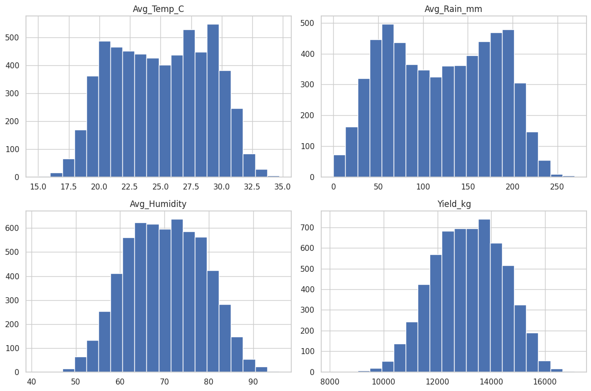
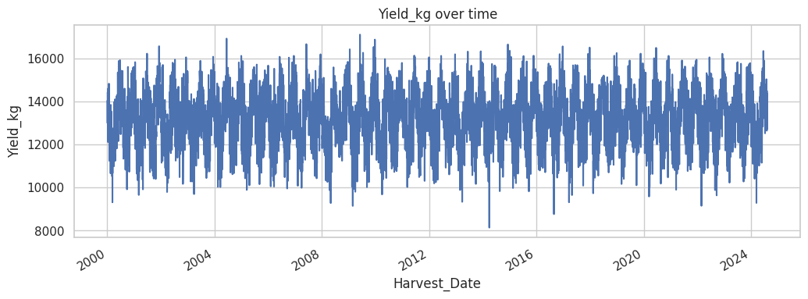

# Crop-Analysis — Pineapple Yield Forecasting


This project includes a **Transformer-based Encoder-Decoder** forecasting model that predicts pineapple yield (kg) based on historical weather patterns and current conditions.

## Model Architecture

**CrossAttentionForecastModel** — Hybrid time-series forecasting with:
- **Transformer Encoder**: processes historical sequence (10-day window of weather + past yields).
- **Cross-Attention Decoder**: attends to encoded history using current weather as query.
- **Positional Encoding**: captures temporal patterns in the input sequence.
- **Feed-Forward Prediction Head**: outputs yield forecast in kg.

Key hyperparameters:
- `d_model=128`, `nhead=4`, `num_layers=3`
- Window size: 10 days
- Batch size: 64
- Learning rate: 0.0001 (AdamW optimizer)
- Early stopping: patience 15 epochs (monitors MAPE)

## Data Generation

Generate synthetic training/test datasets with realistic weather-yield relationships:

```bash
python synthetic_data_generator.py
```

Outputs:
- `data/forecasting_data/synthetic_train_dataset.csv` (6000 records)
- `data/forecasting_data/synthetic_test_dataset.csv` (2000 records)

Features: `Avg_Temp_C`, `Avg_Rain_mm`, `Avg_Humidity`, `Location`, `Soil_Type`  
Target: `Yield_kg`





## Training

Train the forecasting model:

```bash
python train_forecast.py
```

Training features:
- MinMax scaling for numerical features and target.
- One-hot encoding for categorical features (`Location`, `Soil_Type`).
- MSE loss with MAPE/MAE metrics reported each epoch.
- Early stopping: stops when MAPE doesn't improve for 15 epochs.
- Learning rate scheduling: ReduceLROnPlateau (factor=0.5, patience=10).

Outputs:
- Model weights: `runs/forecast_model/best.pt`, `runs/forecast_model/last.pt`
- Preprocessor (scalers + encoders): `runs/forecast_model/preprocessor.pkl`
- Training log: `runs/forecast_model/training.log`
- Summary JSON: `runs/forecast_model/training_summary.json`

## Inference

Run yield prediction with the trained model:

```bash
python inference_forcast.py
```

The script:
- Loads the best model and preprocessor.
- Takes a 10-day historical dataframe + current conditions dictionary.
- Outputs predicted yield in kg.

Example usage (see `inference_forcast.py` main block):
```python
from inference_forcast import PineappleYieldPredictor
import pandas as pd

predictor = PineappleYieldPredictor()

# 10-day history (weather + yields)
history_df = pd.DataFrame({
    'Avg_Temp_C': [26, 27, 25, 26, 28, 27, 26, 25, 26, 27],
    'Avg_Rain_mm': [100, 110, 90, 120, 80, 95, 105, 115, 100, 90],
    'Avg_Humidity': [70, 72, 68, 75, 65, 71, 73, 74, 70, 69],
    'Location': ['Block_A_North'] * 10,
    'Soil_Type': ['Sandy Loam'] * 10,
    'Yield_kg': [14500, 14800, 14200, 15100, 13900, 14600, 14900, 15050, 14700, 14400]
})

# Today's conditions
current_conditions = {
    'Avg_Temp_C': 29.5,
    'Avg_Rain_mm': 60.0,
    'Avg_Humidity': 60.0,
    'Location': 'Block_A_North',
    'Soil_Type': 'Sandy Loam'
}

predicted_yield = predictor.predict(history_df, current_conditions)
print(f"Predicted Yield: {predicted_yield:,.2f} kg")
```

## Evaluation Metrics

- **MAE** (Mean Absolute Error): average error in kg.
- **MAPE** (Mean Absolute Percentage Error): average % error relative to actual yield.
- **MSE** (Mean Squared Error): training loss (penalizes large errors).

Example output from training log:
```
Epoch [25/100] Train Loss: 0.002145 | Test Loss: 0.002378 | MAE: 245.32 kg | MAPE: 1.68%
--> New Best Model Saved (MAPE: 1.68%) at epoch 25
```

Early stopping triggered when MAPE stops improving for 15 consecutive epochs.

## Notes

- Ensure `data/forecasting_data/` directory exists before generating data.
- Model paths in `inference_forcast.py` default to `models/pineapple_forecast/`; update if you save to `runs/forecast_model/`.
- GPU training recommended for faster convergence (automatically detected via PyTorch).
- For production use, retrain with real historical yield + weather data.
