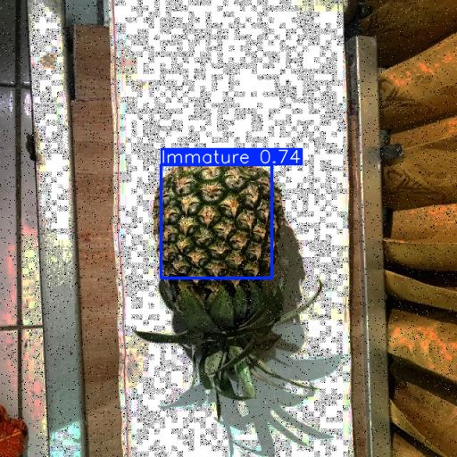

# Crop-Analysis — Pineapple Defect & Ripeness Detection

Quick steps to get data, install dependencies, train models, and run inference.

1) Download datasets
- Roboflow (pineapple defects): open the dataset URL and download the dataset (choose YOLO format) then place/unzip into `data/pineapple_defect`.
  URL: https://universe.roboflow.com/pinapple-defects/pineapple-defect-detection-2-rygms/dataset/1
- Kaggle (pineapple images): download and unzip into `data/`.
  URL: https://www.kaggle.com/datasets/adhilpk/pineapple

2) Install requirements

    python -m pip install -r requirements.txt

4) Train models

- Defect model (uses `config/defect.yaml`):

    python train_defect.py

- Ripeness model (uses `config/ripe.yaml`):

    python train_ripe.py

Outputs
- Checkpoints and run logs: `runs/train/<name>`
- Best/last weights may be under `models/<project>/weights/` or `runs/train/<name>/weights/` depending on how you saved them.

5) Inference

- Edit the top constants in `inference.py` (`WEIGHTS`, `SOURCE`, `CONF`, `DEVICE`) then run:

    python inference.py
    
- Annotated outputs are saved to `runs/infer/<name>` (scripts default to `runs/infer/defect`, `runs/infer/ripe`, or `runs/infer/simple_run`).

6) Quick notes
- Confidence (`CONF`): higher reduces false positives, lower increases sensitivity.
- Device: set `DEVICE='0'` to use GPU 0 or `DEVICE='cpu'` for CPU.
- If dataset paths differ, update `config/defect.yaml` and `config/ripe.yaml` (paths are relative to project root).
