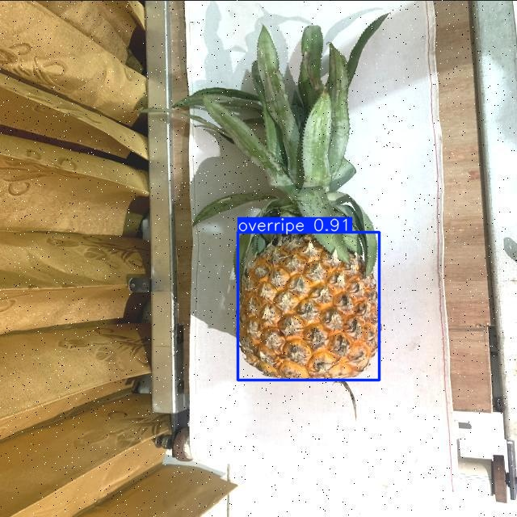
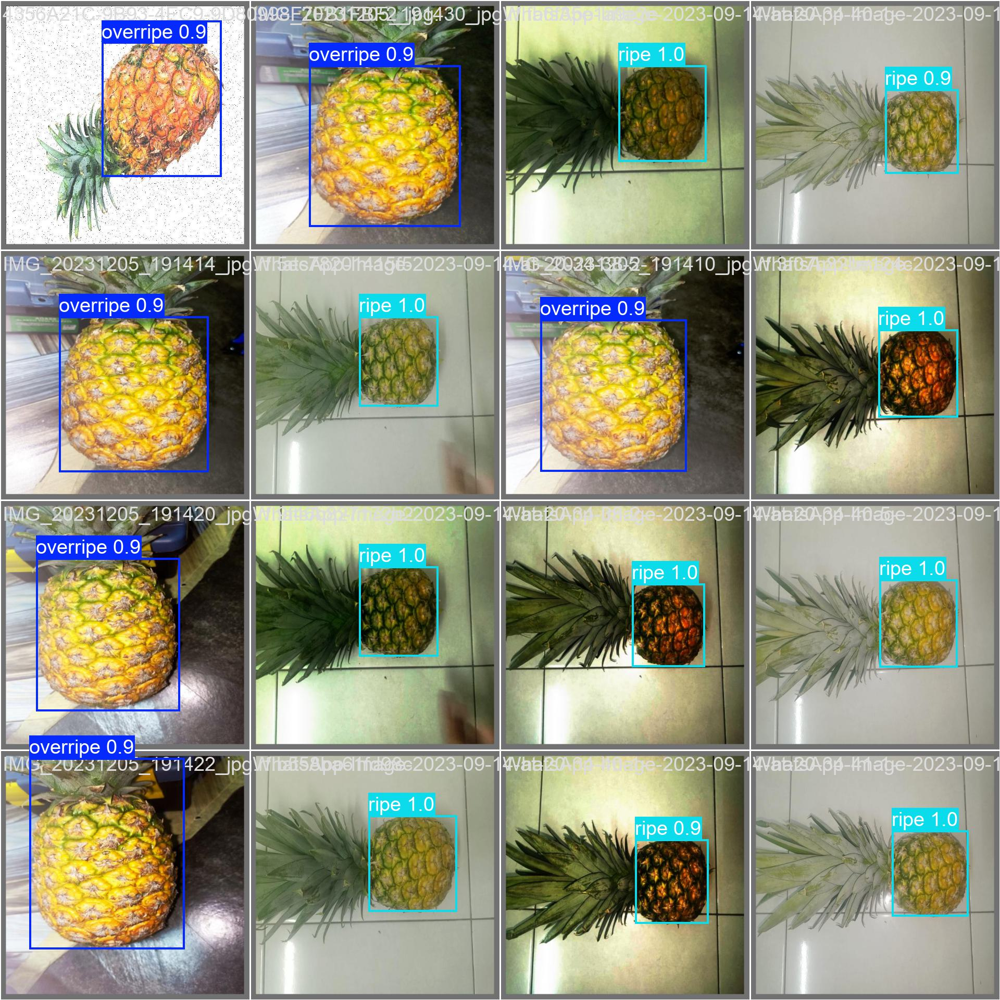

# Crop-Analysis — Pineapple Ripeness Detection




Quick steps to get data, install dependencies, train models, and run inference for pineapple ripeness detection.

## 1) Download Datasets
- Kaggle (pineapple images): Download and unzip into `data/`.
  URL: https://www.kaggle.com/datasets/adhilpk/pineapple
- Roboflow (pineapple ripeness): Open the dataset URL and download the dataset (choose YOLO format) then place/unzip into `data/pineapple_ripe`.
  URL: https://universe.roboflow.com/pineapple-grading-system-ripeness-machine-vision/pineapple-maturity-project-app/dataset/1

## 2) Install Requirements
```bash
python -m pip install -r requirements.txt
```

## 3) Train Model
- Ripeness model (uses `config/ripe.yaml`):
```bash
python train_ripe.py
```
Outputs:
- Checkpoints and run logs: `runs/train/<name>`
- Best/last weights may be under `models/<project>/weights/` or `runs/train/<name>/weights/` depending on how you saved them.

## 4) Inference
- Edit the top constants in `inference.py` (`WEIGHTS`, `SOURCE`, `CONF`, `DEVICE`) then run:
```bash
python inference.py
```
- Annotated outputs are saved to `runs/infer/<name>` (scripts default to `runs/infer/ripe`).

## 5) Quick Notes
- Confidence (`CONF`): Higher reduces false positives, lower increases sensitivity.
- Device: Set `DEVICE='0'` for GPU 0 or `DEVICE='cpu'` for CPU.
- If dataset paths differ, update `config/ripe.yaml` (paths are relative to project root).
